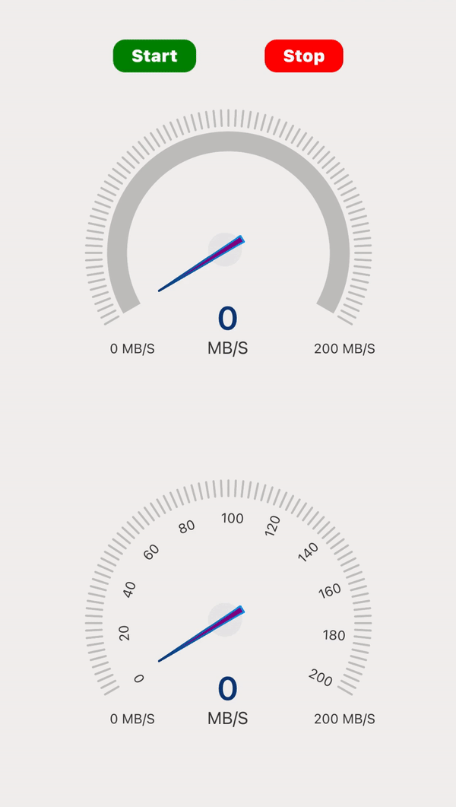
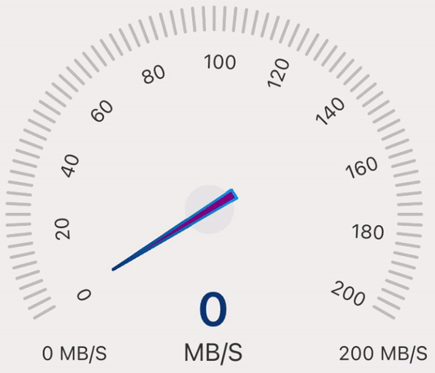

# react-native-radial-slider
[](https://www.npmjs.org/package/react-native-radial-slider)  [](https://www.android.com)  [](https://developer.apple.com/ios)  [](https://opensource.org/licenses/MIT)

---
<br>

This is pure javascript and react-native-svg based library. That provides a radial slider to select any specific value from a range of values and also provides a speedo meter to highlight a specific value from a range of values.

Radial slider has two variants, one is default and that allows selection on a 180-degree arc and second one is 360-degree which allows selection of values on a complete circle. It can be used to select / set goal, vision, criteria, range etc.

The speedometer also has two variants, default one shows a needle and another one shows marking values with a needle. It can be used to display the speed of an internet, vehicle, fan etc.

This library is easy to use and provides you full customization, so you can customize component based on your need.

## 🎬 Preview
---

| RadialSlider | SpeedoMeter |
|--|--|
|  |  |

---

| Quick Access |
|--|
| [Installation](#installation) |
| [RadialSlider](#radialslider) |
| [SpeedoMeter](#speedometer) |
| [Properties](#properties) |
| [Example](#example) |
| [License](#license) |

## Installation

```bash
$ npm install react-native-radial-slider
# --- or ---
$ yarn add react-native-radial-slider
```

## Install additional dependency

```bash
$ npm install react-native-svg
# --- or ---
$ yarn add react-native-svg
```

##### Know more about [react-native-svg](https://www.npmjs.com/package/react-native-svg)


# RadialSlider

- RadialSlider has two different variants, default one and radial-circle-slider
- RadialSlider can be used to select / set goal, vision, criteria, range etc

## Default RadialSlider

#### 🎬 Preview

---


#### Usage

---

```jsx
import React, { useState } from 'react';
import { StyleSheet, View } from 'react-native';
import { RadialSlider } from 'react-native-radial-slider';

const RadialVariant = () => {
  const [speed, setSpeed] = useState(0);

  return (
    <View style={styles.container}>
      <RadialSlider value={speed} min={0} max={200} onChange={setSpeed} />
    </View>
  );
};

const styles = StyleSheet.create({
  container: {
    flex: 1,
    justifyContent: 'center',
  },
});

export default RadialVariant;
```

## Radial Circle Silder

#### 🎬 Preview

---


#### Usage

---

```jsx
import React, { useState } from 'react';
import { StyleSheet, View } from 'react-native';
import { RadialSlider } from 'react-native-radial-slider';

const RadialVariant = () => {
  const [speed, setSpeed] = useState(0);

  return (
    <View style={styles.container}>
      <RadialSlider
        value={speed}
        min={0}
        max={200}
        onChange={setSpeed}
        variant="radial-circle-slider"
      />
    </View>
  );
};

const styles = StyleSheet.create({
  container: {
    flex: 1,
    justifyContent: 'center',
  },
});

export default RadialVariant;
```

# SpeedoMeter

- SpeedoMeter has two different variants, default one and speedometer-marker
- SpeedoMeter can be used to display the speed of an internet, vehicle, fan etc

## Default SpeedoMeter

#### 🎬 Preview

---


#### Usage

---

```jsx
import React, { useState, useEffect } from 'react';
import { StyleSheet, View } from 'react-native';
import { SpeedoMeter } from 'react-native-radial-slider';

const SpeedoMeterVariant = () => {
  const [speed, setSpeed] = useState(0);

  return (
    <View style={styles.container}>
      <SpeedoMeter value={speed} min={0} max={200} onChange={setSpeed} />
    </View>
  );
};

const styles = StyleSheet.create({
  container: {
    flex: 1,
    justifyContent: 'center',
  },
});

export default SpeedoMeterVariant;
```

## SpeedoMeter Marker

#### 🎬 Preview

---


#### Usage

---

```jsx
import React, { useState, useEffect } from 'react';
import { StyleSheet, View } from 'react-native';
import { SpeedoMeter } from 'react-native-radial-slider';

const SpeedoMeterVariant = () => {
  const [speed, setSpeed] = useState(0);

  return (
    <View style={styles.container}>
      <SpeedoMeter
        value={speed}
        min={0}
        max={200}
        onChange={setSpeed}
        variant="speedometer-marker"
      />
    </View>
  );
};

const styles = StyleSheet.create({
  container: {
    flex: 1,
    justifyContent: 'center',
  },
});

export default SpeedoMeterVariant;
```

---

## Properties

| Prop                  | Default                                                                | Type     | Description                                                                                                                  | RadialSlider | SpeedoMeter |
| :-------------------- | :--------------------------------------------------------------------- | :------- | :--------------------------------------------------------------------------------------------------------------------------- | ------------ | ----------- |
| radius                | 100                                                                    | number   | Size of component                                                                                                            | ✅           | ✅          |
| min                   | 0                                                                      | number   | Minimum value                                                                                                                | ✅           | ✅          |
| max                   | 100                                                                    | number   | Maximum value                                                                                                                    | ✅           | ✅          |
| step                  | 1                                                                      | number   | Step value for component                                                                                                     | ✅           | ✅          |
| statusTitle           | -                                                                      | string   | Status title                                                                                                                 | ✅           | ✅          |
| statusValue           | -                                                                      | number   | Status value                                                                                                                 | ✅           | ✅          |
| markerValue           | -                                                                      | number   | Show marker on specific number                                                                                               | ✅           | ✅          |
| value                 | 0                                                                      | numbe    | Show selection upto this value                                                                                               | ✅           | ✅          |
| title                 | -                                                                      | string   | Title for component                                                                                                          | ✅           | ✅          |
| subTitle              | Goal                                                                   | string   | Subtitle for component                                                                                                       | ✅           | ❌          |
| unit                  | RadilaSlider: 'kCal', SpeedoMeter: 'MB/S'                              | string   | Unit for component                                                                                                           | ✅           | ✅          |
| thumbRadius           | 18                                                                     | number   | Thumb for component                                                                                                          | ✅           | ✅          |
| thumbColor            | #008ABC                                                                | string   | Color for thumb                                                                                                              | ✅           | ✅          |
| thumbBorderWidth      | 5                                                                      | number   | Width for thumb                                                                                                              | ✅           | ✅          |
| thumbBorderColor      | #FFFFFF                                                                | string   | Border Color for thumb                                                                                                       | ✅           | ✅          |
| markerLineSize        | 50                                                                     | number   | Size of marker line                                                                                                          | ✅           | ✅          |
| sliderWidth           | 18                                                                     | number   | Width of slider                                                                                                              | ✅           | ✅          |
| sliderTrackColor      | #E5E5E5                                                                | string   | Color of unselected slider track                                                                                             | ✅           | ✅          |
| lineColor             | #E5E5E5                                                                | string   | Color of unselected lines                                                                                                    | ✅           | ✅          |
| lineSpace             | 3                                                                      | number   | Space between each line                                                                                                      | ✅           | ✅          |
| linearGradient        | [ { stop: '0%', color:'#ffaca6' }, { stop: '100%', color: '#EA4800' }] | object   | Gradient color of selected track                                                                                             | ✅           | ✅          |
| onChange              | -                                                                      | function | Callback function which fired on change in track                                                                             | ✅           | ✅          |
| onComplete            | -                                                                      | function | Callback function which defines what to do after completion                                                                  | ✅           | ✅          |
| statusContainerStyle  | {}                                                                     | object   | Status container style                                                                                                       | ✅           | ✅          |
| statusTitleStyle      | {}                                                                     | object   | Status title text style                                                                                                      | ✅           | ✅          |
| statusValueStyle      | {}                                                                     | object   | Status value text style                                                                                                      | ✅           | ✅          |
| centerContentStyle    | {}                                                                     | object   | Center content style                                                                                                         | ✅           | ✅          |
| titleStyle            | {}                                                                     | object   | Status title container style                                                                                                 | ✅           | ✅          |
| subTitleStyle         | {}                                                                     | object   | Status subtitle text style                                                                                                   | ✅           | ✅          |
| valueStyle            | {}                                                                     | object   | Center value style                                                                                                           | ✅           | ✅          |
| buttonContainerStyle  | {}                                                                     | object   | Button container style                                                                                                       | ✅           | ✅          |
| letIconStyle          | {}                                                                     | object   | Left Icon style                                                                                                              | ✅           | ✅          |
| rightIconStyle        | {}                                                                     | object   | Right Icon style                                                                                                             | ✅           | ✅          |
| contentStyle          | {}                                                                     | object   | Whole content style                                                                                                          | ✅           | ✅          |
| unitStyle             | {}                                                                     | object   | Unit text style                                                                                                              | ✅           | ✅          |
| style                 | {}                                                                     | object   | Inner container style                                                                                                        | ✅           | ✅          |
| openingRadian         | RadialSlider: Math.PI / 3 , SpeedoMeter:0.01                           | number   | Radian of component                                                                                                          | ✅           | ✅          |
| disabled              | false                                                                  | boolean  | If true, buttons will be in disabled state                                                                                   | ✅           | ❌          |
| dynamicMarker         | false                                                                  | boolean  | If false, marker will be static                                                                                              | ✅           | ✅          |
| isHideSlider          | false                                                                  | boolean  | If true, slider will be hidden                                                                                               | ✅           | ✅          |
| isHideStatus          | false                                                                  | boolean  | If true, status will be hidden                                                                                               | ✅           | ❌          |
| isHideCenterContent   | false                                                                  | boolean  | If true, center content will be hidden                                                                                       | ✅           | ✅          |
| isHideTitle           | false                                                                  | boolean  | If true, title will be hidden                                                                                                | ✅           | ❌          |
| isHideSubtitle        | false                                                                  | boolean  | If true, subtitle will be hidden                                                                                             | ✅           | ❌          |
| isHideValue           | false                                                                  | boolean  | If true, value will be hidden                                                                                                | ✅           | ❌          |
| isHideTailText        | false                                                                  | boolean  | If true, tail text will be hidden                                                                                            | ✅           | ✅          |
| isHideButtons         | false                                                                  | boolean  | If true, buttons will be hidden                                                                                              | ✅           | ❌          |
| isHideLines           | false                                                                  | boolean  | If true,slider lines will be hidden                                                                                          | ✅           | ✅          |
| isHideMarkerLine      | false                                                                  | boolean  | If true, marked lines will be hidden                                                                                         | ✅           | ✅          |
| fixedMarker           | false                                                                  | boolean  | If true, marked value will be hidden                                                                                         | ✅           | ✅          |
| variant               | default                                                                | string   | Different component variants. RadialSlider: default & radial-circle-slider , SpeedoMeter: default & speedometer-marker | ✅           | ✅          |
| onPress               | {}                                                                     | function | Based on click value will be increased or decreased                                                                          | ✅           | ❌          |
| stroke                | '#008ABC'                                                              | string   | Color for button icon                                                                                                        | ✅           | ❌          |
| hideStyle             | {}                                                                     | object   | Content style                                                                                                                | ❌           | ✅          |
| markerCircleSize      | 15                                                                     | number   | Size for marker circle                                                                                                       | ❌           | ✅          |
| markerCircleColor     | #E5E5E5                                                                | string   | Color for marker circle                                                                                                      | ❌           | ✅          |
| markerPositionY       | 20                                                                     | number   | Marker position for up and down                                                                                              | ❌           | ✅          |
| markerPositionX       | 20                                                                     | number   | Marker position for right and left                                                                                           | ❌           | ✅          |
| needleBackgroundColor | #A020F0                                                                | string   | Background color for needle                                                                                                   | ❌           | ✅          |
| needleColor           | [ { stop: '0%', color:'#ffaca6' }, { stop: '100%', color: '#EA4800' }] | object   | Color for needle                                                                                                             | ❌           | ✅          |
| needleBorderWidth     | 1.5                                                                    | number   | Width of needle                                                                                                              | ❌           | ✅          |
| needleHeight          | 30                                                                     | number   | Width of needle                                                                                                              | ❌           | ✅          |
| markerValueInterval   | 10                                                                     | number   | Show number of value in sequence                                                                                             | ❌           | ✅          |
| markerValueColor      | #333333                                                                | string   | Color for marker value                                                                                                       | ❌           | ✅          |
| strokeLinecap         | butt                                                                   | string   | Different types of strokeline like butt ,square ,round                                                                       | ❌           | ✅          |

---

## Example

A full working example project is here [Example](./example/src/App.tsx)

```sh
$ yarn
$ yarn example ios   // For ios
$ yarn example android   // For Android
```

## Find this library useful? ❤️
Support it by joining [stargazers](https://github.com/SimformSolutionsPvtLtd/react-native-radial-slider/stargazers) for this repository.⭐

## 🤝 How to Contribute

We'd love to have you improve this library or fix a problem 💪
Check out our [Contributing Guide](CONTRIBUTING.md) for ideas on contributing.

## Bugs / Feature requests / Feedbacks

For bugs, feature requests, and discussion please use [GitHub Issues](https://github.com/SimformSolutionsPvtLtd/react-native-radial-slider/issues)

## License

- [MIT License](LICENSE)
