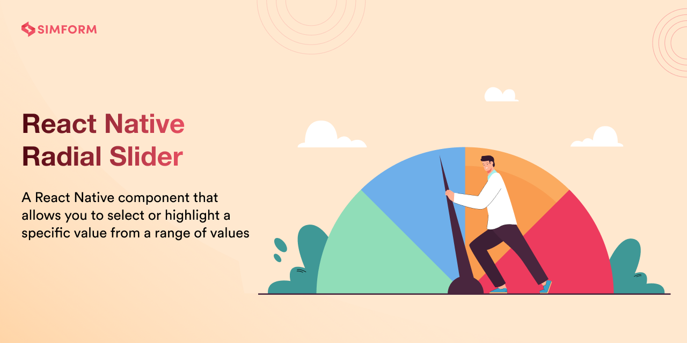
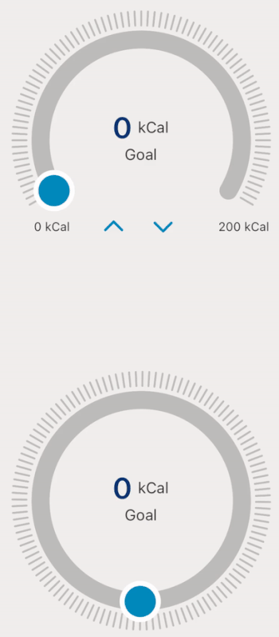
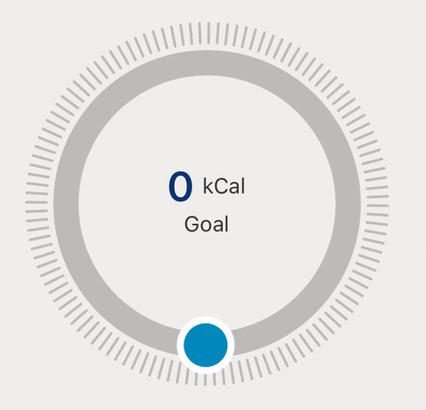
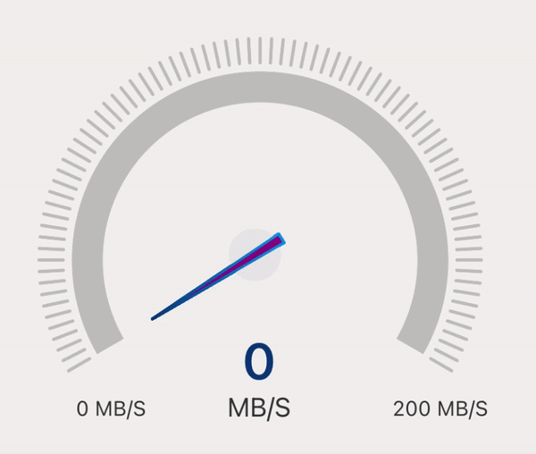

# react-native-radial-slider

[](https://www.npmjs.com/package/react-native-radial-slider) [](https://www.npmtrends.com/react-native-radial-slider) [](https://packagephobia.com/result?p=react-native-radial-slider) [](https://www.android.com) [](https://developer.apple.com/ios) [](https://opensource.org/licenses/MIT)

---

This is a pure javascript and react-native-svg based library that provides many variants of `Radial Slider` and `Speedo Meter` including `default`, `radial-circle-slider`, `speedometer` and `speedometer-marker`

Radial Slider allows you to select any specific value from a range of values. It comes with two variants, one is default which allows selection on a 180-degree arc and the second one is 360-degree which allows selection of values on a complete circle. It can be used to select/set goals, vision, range, etc.

The Speedo Meter allows you to highlight a specific value from a range of values. It comes with two variants, the default one shows a needle and another one shows marking values with a needle. It can be used to display the speed of the internet, vehicle, fan, etc.

This library is easy to use and provides you complete customization, so you can customize components based on your need.

## 🎬 Preview

| RadialSlider                                          | SpeedoMeter                                         |
| ----------------------------------------------------- | --------------------------------------------------- |
|  |  |

---

## Quick Access

[Installation](#installation) | [RadialSlider](#radialslider) | [SpeedoMeter](#speedometer) | [Properties](#properties) | [Example](#example) | [License](#license)

## Installation

##### 1. Install library and react-native-svg

```bash
$ npm install react-native-radial-slider react-native-svg
# --- or ---
$ yarn add react-native-radial-slider react-native-svg
```

##### 2. Install cocoapods in the ios project

```bash
cd ios && pod install
```

##### Know more about [react-native-svg](https://www.npmjs.com/package/react-native-svg)

# RadialSlider

- RadialSlider has two different variants, 'default' and 'radial-circle-slider'
- RadialSlider can be used to select / set goal, vision, range etc

## Default RadialSlider

#### 🎬 Preview

---


#### Usage

---

```jsx
import React, { useState } from 'react';
import { StyleSheet, View } from 'react-native';
import { RadialSlider } from 'react-native-radial-slider';

const RadialVariant = () => {
  const [speed, setSpeed] = useState(0);

  return (
    <View style={styles.container}>
      <RadialSlider value={speed} min={0} max={200} onChange={setSpeed} />
    </View>
  );
};

const styles = StyleSheet.create({
  container: {
    flex: 1,
    justifyContent: 'center',
  },
});

export default RadialVariant;
```

## Radial Circle Slider

#### 🎬 Preview

---



#### Usage

---

```jsx
import React, { useState } from 'react';
import { StyleSheet, View } from 'react-native';
import { RadialSlider } from 'react-native-radial-slider';

const RadialVariant = () => {
  const [speed, setSpeed] = useState(0);

  return (
    <View style={styles.container}>
      <RadialSlider
        variant={'radial-circle-slider'}
        value={speed}
        min={0}
        max={200}
        onChange={setSpeed}
      />
    </View>
  );
};

const styles = StyleSheet.create({
  container: {
    flex: 1,
    justifyContent: 'center',
  },
});

export default RadialVariant;
```

# SpeedoMeter

> The speedometer will not take user inputs, when we need to update dynamic values at that time we can use it

- SpeedoMeter has two different variants, speedometer and speedometer-marker
- SpeedoMeter can be used to display the speed of an internet, vehicle, fan etc

## SpeedoMeter

#### 🎬 Preview

---



#### Usage

---

```jsx
import React, { useState } from 'react';
import { StyleSheet, View } from 'react-native';
import { RadialSlider } from 'react-native-radial-slider';

const SpeedoMeterVariant = () => {
  const [speed, setSpeed] = useState(0);

  return (
    <View style={styles.container}>
      <RadialSlider
        variant={'speedometer'}
        value={speed}
        min={0}
        max={200}
        onChange={setSpeed}
      />
    </View>
  );
};

const styles = StyleSheet.create({
  container: {
    flex: 1,
    justifyContent: 'center',
  },
});

export default SpeedoMeterVariant;
```

## SpeedoMeter Marker

#### 🎬 Preview

---


#### Usage

---

```jsx
import React, { useState } from 'react';
import { StyleSheet, View } from 'react-native';
import { RadialSlider } from 'react-native-radial-slider';

const SpeedoMeterVariant = () => {
  const [speed, setSpeed] = useState(0);

  return (
    <View style={styles.container}>
      <RadialSlider
        variant={'speedometer-marker'}
        value={speed}
        min={0}
        max={200}
        onChange={setSpeed}
      />
    </View>
  );
};

const styles = StyleSheet.create({
  container: {
    flex: 1,
    justifyContent: 'center',
  },
});

export default SpeedoMeterVariant;
```

---

## Properties

| Prop                  | Default                                                                    | Type           | Description                                                                              | RadialSlider | SpeedoMeter |
| :-------------------- | :------------------------------------------------------------------------- | :------------- | :--------------------------------------------------------------------------------------- | ------------ | ----------- |
| **min\***             | 0                                                                          | number         | Minimum value                                                                            | ✅           | ✅          |
| **max\***             | 100                                                                        | number         | Maximum value                                                                            | ✅           | ✅          |
| **value\***           | 0                                                                          | number         | Show selection upto this value                                                           | ✅           | ✅          |
| **onChange\***        | -                                                                          | function       | Callback function that invokes on change in track                                        | ✅           | ✅          |
| radius                | 100                                                                        | number         | Size of component                                                                        | ✅           | ✅          |
| startAngle            | 270                                                                        | number [1-360] | The angle at which the circular slider should start from.                                | ✅           | ❌          |
| step                  | 1                                                                          | number         | Step value for component                                                                 | ✅           | ❌          |
| markerValue           | -                                                                          | number         | Show marker on specific number                                                           | ✅           | ✅          |
| title                 | -                                                                          | string         | Title for component                                                                      | ✅           | ❌          |
| subTitle              | Goal                                                                       | string         | Subtitle for component                                                                   | ✅           | ❌          |
| unit                  | RadialSlider: 'kCal', SpeedoMeter: 'MB/S'                                  | string         | Unit for component                                                                       | ✅           | ✅          |
| thumbRadius           | 18                                                                         | number         | Radius for thumb                                                                         | ✅           | ❌          |
| thumbColor            | #008ABC                                                                    | string         | Color for thumb                                                                          | ✅           | ❌          |
| thumbBorderWidth      | 5                                                                          | number         | Width for thumb                                                                          | ✅           | ❌          |
| thumbBorderColor      | #FFFFFF                                                                    | string         | Border Color for thumb                                                                   | ✅           | ❌          |
| markerLineSize        | 50                                                                         | number         | Size of marker line                                                                      | ✅           | ✅          |
| sliderWidth           | 18                                                                         | number         | Width of slider                                                                          | ✅           | ✅          |
| sliderTrackColor      | #E5E5E5                                                                    | string         | Color of unselected slider track                                                         | ✅           | ✅          |
| lineColor             | #E5E5E5                                                                    | string         | Color of unselected lines                                                                | ✅           | ✅          |
| lineSpace             | 3                                                                          | number         | Space between each line                                                                  | ✅           | ✅          |
| linearGradient        | [ { offset: '0%', color:'#ffaca6' }, { offset: '100%', color: '#EA4800' }] | object         | Gradient color of selected track                                                         | ✅           | ✅          |
| onComplete            | -                                                                          | function       | Callback function which defines what to do after completion                              | ✅           | ✅          |
| centerContentStyle    | {}                                                                         | object         | Center content style                                                                     | ✅           | ❌          |
| titleStyle            | {}                                                                         | object         | Status title container style                                                             | ✅           | ❌          |
| subTitleStyle         | {}                                                                         | object         | Status subtitle text style                                                               | ✅           | ❌          |
| valueStyle            | {}                                                                         | object         | Center value style                                                                       | ✅           | ✅          |
| buttonContainerStyle  | {}                                                                         | object         | Button container style                                                                   | ✅           | ❌          |
| leftIconStyle         | {}                                                                         | object         | Left Icon style                                                                          | ✅           | ❌          |
| rightIconStyle        | {}                                                                         | object         | Right Icon style                                                                         | ✅           | ❌          |
| contentStyle          | {}                                                                         | object         | Whole content style                                                                      | ✅           | ✅          |
| unitStyle             | {}                                                                         | object         | Unit text style                                                                          | ✅           | ✅          |
| style                 | {}                                                                         | object         | Inner container style                                                                    | ✅           | ✅          |
| openingRadian         | RadialSlider: Math.PI / 3 , SpeedoMeter:0.057                              | number         | Radian of component                                                                      | ✅           | ✅          |
| disabled              | false                                                                      | boolean        | If true, buttons will be in disabled state                                               | ✅           | ❌          |
| isHideSlider          | false                                                                      | boolean        | If true, slider will be hidden                                                           | ✅           | ✅          |
| isHideCenterContent   | false                                                                      | boolean        | If true, center content will be hidden                                                   | ✅           | ✅          |
| isHideTitle           | false                                                                      | boolean        | If true, title will be hidden                                                            | ✅           | ❌          |
| isHideSubtitle        | false                                                                      | boolean        | If true, subtitle will be hidden                                                         | ✅           | ❌          |
| isHideValue           | false                                                                      | boolean        | If true, value will be hidden                                                            | ✅           | ✅          |
| isHideTailText        | false                                                                      | boolean        | If true, tail text will be hidden                                                        | ✅           | ✅          |
| isHideButtons         | false                                                                      | boolean        | If true, buttons will be hidden                                                          | ✅           | ❌          |
| isHideLines           | false                                                                      | boolean        | If true,slider lines will be hidden                                                      | ✅           | ✅          |
| isHideMarkerLine      | false                                                                      | boolean        | If true, marked lines will be hidden                                                     | ✅           | ✅          |
| fixedMarker           | false                                                                      | boolean        | If true, marked value will be hidden                                                     | ✅           | ✅          |
| variant               | default                                                                    | string         | Different component variants `radial-circle-slider`, `speedometer`, `speedometer-marker` | ✅           | ✅          |
| onPress               | {}                                                                         | function       | Based on click value will be increased or decreased                                      | ✅           | ❌          |
| stroke                | '#008ABC'                                                                  | string         | Color for button icon                                                                    | ✅           | ❌          |
| unitValueContentStyle | {}                                                                         | object         | Unit value content style                                                                 | ❌           | ✅          |
| markerCircleSize      | 15                                                                         | number         | Size for marker circle                                                                   | ❌           | ✅          |
| markerCircleColor     | #E5E5E5                                                                    | string         | Color for marker circle                                                                  | ❌           | ✅          |
| markerPositionY       | 20                                                                         | number         | Marker position for up and down                                                          | ❌           | ✅          |
| markerPositionX       | 20                                                                         | number         | Marker position for right and left                                                       | ❌           | ✅          |
| needleBackgroundColor | #A020F0                                                                    | string         | Background color for needle                                                              | ❌           | ✅          |
| needleColor           | #175BAD                                                                    | string         | Color for needle                                                                         | ❌           | ✅          |
| needleBorderWidth     | 1.5                                                                        | number         | Width of needle border                                                                   | ❌           | ✅          |
| needleHeight          | 30                                                                         | number         | Height of needle                                                                         | ❌           | ✅          |
| markerValueInterval   | 10                                                                         | number         | Show number of value in sequence                                                         | ❌           | ✅          |
| markerValueColor      | #333333                                                                    | string         | Color for marker value                                                                   | ❌           | ✅          |
| strokeLinecap         | butt                                                                       | string         | Line terminations, can be butt, line, or square                                          | ❌           | ✅          |

---

## Example

A full working example project is here [Example](./example/src/App.tsx)

```sh
yarn
yarn example ios   // For ios
yarn example android   // For Android
```

## Find this library useful? ❤️

Support it by joining [stargazers](https://github.com/SimformSolutionsPvtLtd/react-native-radial-slider/stargazers) for this repository.⭐

## 🤝 How to Contribute

We'd love to have you improve this library or fix a problem 💪
Check out our [Contributing Guide](CONTRIBUTING.md) for ideas on contributing.

## Bugs / Feature requests / Feedbacks

For bugs, feature requests, and discussion please use [GitHub Issues](https://github.com/SimformSolutionsPvtLtd/react-native-radial-slider/issues)

## License

- [MIT License](LICENSE)
